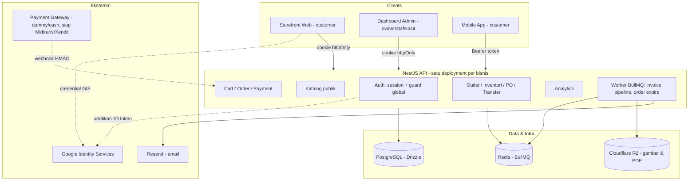
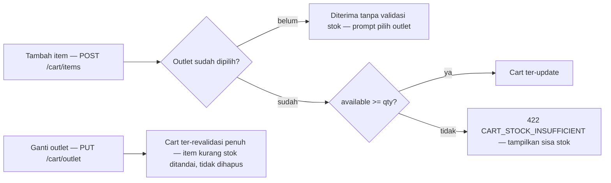
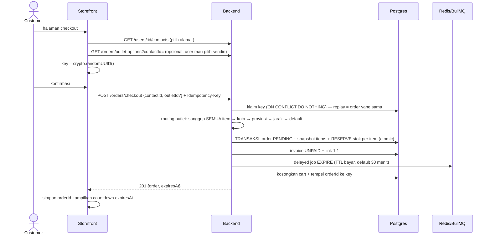
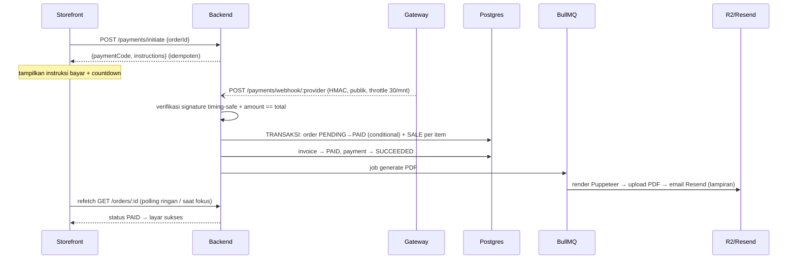
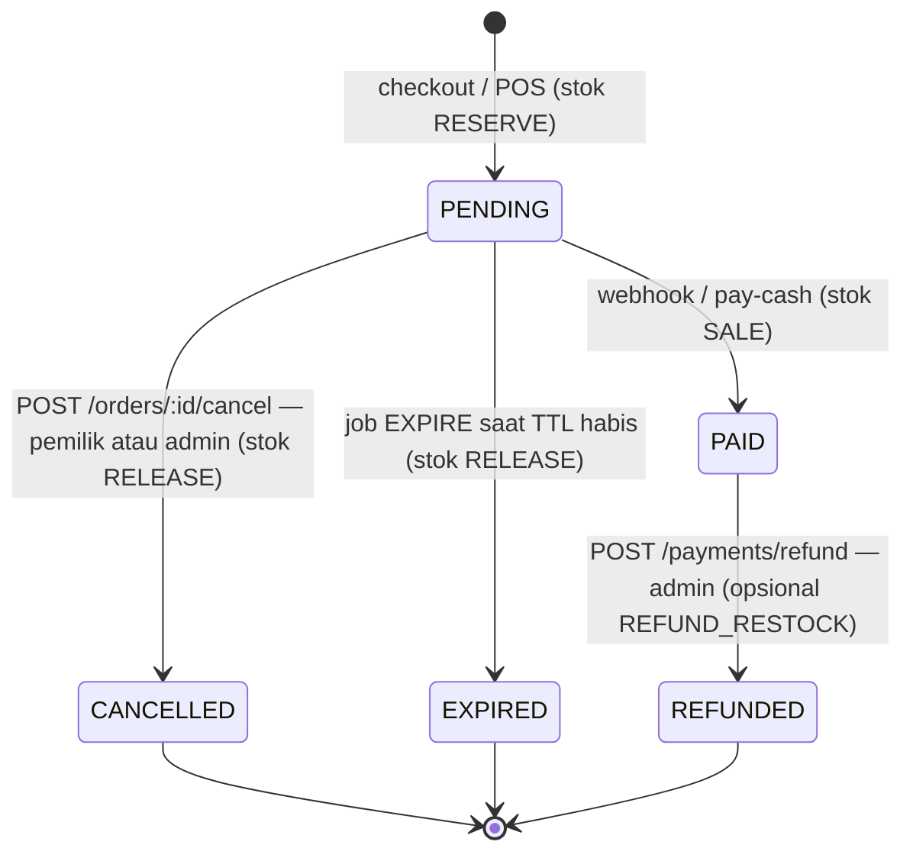
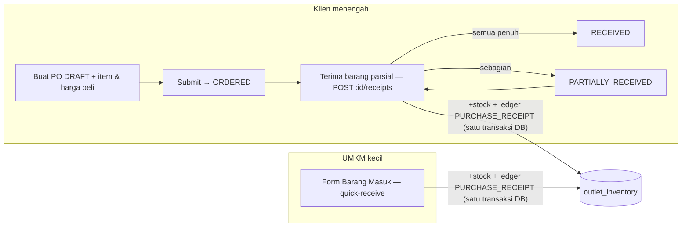
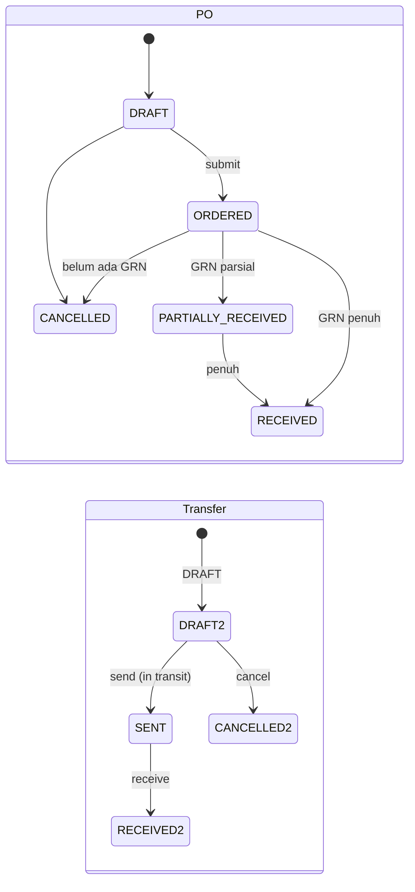

# Business Flow End-to-End (Frontend → Backend)

Dokumen lengkap sistem dari sisi pengguna sampai database: overview & arsitektur,
tech stack, requirement ringkas, konvensi integrasi FE↔BE, journey end-to-end per
alur bisnis, state machine, integrasi eksternal, dan roadmap.

Pasangan dokumen: [PRD](./PRD.md) (kebutuhan detail) · [ERD](./ERD.md) (skema data) ·
[openapi.yaml](./openapi.yaml) (kontrak API per-endpoint).

---

## 1. Overview

Platform e-commerce **multi-outlet untuk satu bisnis** (dijual per-bisnis oleh software
house — bukan SaaS multi-tenant). Satu backend melayani tiga jenis client dengan
**stok per-cabang sebagai pusat kebenaran**: semua pergerakan barang (beli, jual online,
jual kasir, pindah cabang, koreksi, retur) melewati satu pintu tervalidasi dan
meninggalkan jejak audit.

**Prinsip inti**: available stock = `stock − reservedStock` per (outlet, variant).
Checkout me-*reservasi*, pembayaran me-*finalisasi*, batal/kedaluwarsa me-*lepas* —
dan setiap mutasi menulis ledger `stock_movements` dalam transaksi DB yang sama.

### Arsitektur



Pembagian tanggung jawab FE vs BE:

| | Storefront (customer) | Dashboard (admin/kasir) |
|---|---|---|
| Auth | register/login/Google, cookie httpOnly | login staf, cookie httpOnly |
| Baca | katalog publik (tanpa login), cart, order miliknya | semua modul operasional + analytics |
| Tulis | cart, checkout, initiate payment, event product-view | katalog, inventori, PO/GRN, transfer, POS, refund, user |
| Tidak boleh | melihat order orang lain (404), endpoint admin (403) | — |

---

## 2. Tech Stack

### Backend (terimplementasi)

| Lapisan | Teknologi | Catatan |
|---|---|---|
| Runtime/bahasa | Node.js 20+, TypeScript strict (no `any`) | |
| Framework | NestJS 11 (Express) | guard global, interceptor envelope, exception filter |
| Database | PostgreSQL 14+ + **Drizzle ORM** | migrasi `drizzle-kit`; CHECK & partial unique sebagai pagar integritas |
| Queue | **BullMQ + Redis** | invoice pipeline (PDF→R2→email), auto-expire order; retry exponential |
| Storage | Cloudflare R2 (S3-compatible) | gambar (WebP via **sharp**) & PDF invoice |
| PDF | **Puppeteer** | render HTML invoice → PDF |
| Email | **Resend** | invoice berlampiran PDF |
| Auth | session opaque (hash SHA-256) + **google-auth-library** (GIS) + bcrypt | dua transport: Bearer & cookie httpOnly |
| Proteksi | @nestjs/throttler (rate limit), idempotency key (checkout), HMAC webhook | |
| Validasi | class-validator/transformer (whitelist + forbid) | |
| Testing | Jest — 24 suites / 113 tests | util murni + service kritis ber-mock |
| Dokumentasi | OpenAPI 3.0 multi-file (Redocly) | `pnpm docs:lint / docs:preview / docs:bundle` |

### Frontend (rekomendasi — kontraknya sudah disiapkan backend)

| Kebutuhan | Rekomendasi | Alasan dari sisi kontrak API |
|---|---|---|
| Framework | Next.js (App Router) untuk storefront & dashboard | katalog publik bisa SSR/ISR (endpoint GET publik tanpa auth) |
| Data fetching | TanStack Query / SWR | pola refetch order setelah bayar, invalidasi cart per mutasi |
| Auth web | cookie httpOnly otomatis — cukup `credentials: 'include'` + `GET /auth/me` saat hydrate | tidak menyimpan token di JS (tahan XSS) |
| Auth mobile | simpan `token` body di Keychain/Keystore, kirim Bearer | response login memuat `token` + `expiresAt` |
| Login Google | Google Identity Services (GIS) di FE → kirim `credential` | backend verifikasi audience `GOOGLE_CLIENT_ID` yang sama |
| Form | react-hook-form + zod | error 400 `fields` dari class-validator bisa dipetakan per-field |
| Client API | generate dari `docs/openapi.yaml` (openapi-typescript) | `pnpm docs:bundle` untuk generator non-multi-file |

### Infrastruktur minimal produksi

App Node (1 instance cukup untuk skala sasaran) + PostgreSQL + Redis + bucket R2 +
domain ber-HTTPS (cookie `secure` menuntut HTTPS). Env lengkap: [.env.example](../.env.example).

---

## 3. Requirement (ringkas)

Detail penuh + business rules di [PRD](./PRD.md). Ringkasan per modul:

| Modul | Kemampuan inti | Akses |
|---|---|---|
| Auth | register/login/Google GIS, sesi 30 hari revocable, dua transport, role, suspend | publik / semua |
| Katalog | produk+variant (dual SKU), media WebP, brand/kategori/attribute, promo terjadwal | GET publik, mutasi admin |
| Outlet & inventori | stok per (outlet,variant), adjustment ber-audit, **ledger 8 tipe mutasi** | admin (info outlet publik) |
| Cart | 1 cart/user terikat 1 outlet, harga live, re-validasi saat ganti outlet | customer login |
| Order | routing outlet otomatis (kebijakan A), **reservasi 2 fase**, idempotent checkout, TTL+auto-expire, POS offline | customer / kasir |
| Payment | gateway provider-agnostic (dummy HMAC), pay-cash, **refund + restock** | customer / admin / webhook |
| Invoice | 1:1 dengan order, pipeline PDF→R2→email asinkron | otomatis + admin |
| Purchasing | supplier, PO→GRN parsial (over-receipt ber-flag), **quick-receive 1 langkah** | admin |
| Transfer | antar outlet DRAFT→SENT→RECEIVED dari available | admin |
| Analytics | revenue/AOV/growth MoM-YoY, series, best seller, slow-moving, alert stok, views vs purchases | admin |

Non-fungsional kunci: envelope response konsisten, error ber-kode, cursor pagination,
rate limit per-endpoint, semua operasi retry-sensitive idempoten, uang integer Rupiah.

---

## 4. Konvensi integrasi FE ↔ BE

Hal-hal yang berlaku untuk SEMUA alur di bagian 5.

**Base URL & versioning** — semua route di bawah **`/api/v1`** (URI versioning;
seluruh path di dokumen ini relatif terhadap base itu — `const API =
'https://<host>/api/v1'`). Versi berikutnya hidup berdampingan di `/api/v2`
per-endpoint, jadi FE tidak perlu big-bang migration.

**Envelope** — semua response sukses `{ ok: true, data }` (list +`metadata`),
error `{ ok: false, error: { code, category, message, details, fields } }`. FE cukup
satu interceptor: `if (!res.ok) throw mapError(body.error)`.

**Autentikasi dua transport**

```ts
// WEB (storefront/dashboard) — cookie httpOnly, tidak pegang token sama sekali
await fetch(`${API}/auth/login`, { method: 'POST', credentials: 'include', ... });
// selanjutnya SEMUA request: credentials: 'include'
// saat refresh halaman: GET /auth/me → 200 = sesi hidup, 401 = redirect login

// MOBILE — token dari body, simpan aman, kirim manual
const { data } = await login();           // { token, expiresAt, user }
headers: { Authorization: `Bearer ${token}` }
```

**Pemetaan error → aksi UI** (kode terpenting):

| Kode | HTTP | Aksi FE |
|---|---|---|
| `AUTH_TOKEN_MISSING` / `AUTH_SESSION_*` | 401 | redirect login / hapus sesi lokal |
| `FORBIDDEN` | 403 | sembunyikan/disable fitur (salah role) |
| `VALIDATION_FAILED` (`fields`) | 400 | tampilkan error per-field form |
| `CART_STOCK_INSUFFICIENT` | 422 | tampilkan sisa stok dari `details.availableStock` |
| `ORDER_UNFULFILLABLE` | 422 | dialog per item `requested` vs `bestAvailable` |
| `IDEMPOTENCY_CONFLICT` | 409 | "sedang diproses" — jangan auto-retry |
| `RATE_LIMIT_EXCEEDED` | 429 | backoff + toast |

**Pagination** — kirim `cursor` dari `metadata.nextCursor` halaman sebelumnya
(keyset, tanpa total count → UI "load more", bukan nomor halaman).

**Idempotency** — `POST /orders/checkout` wajib header `Idempotency-Key`
(FE generate `crypto.randomUUID()` SEKALI per sesi checkout; key yang sama
di-reuse saat retry — bukan per klik).

**Upload** — multipart dengan nama field persis: `logo` (brand), `image`
(kategori & media produk), `thumbnail` (produk).

---

## 5. Journey end-to-end (FE → BE → infra)

### 5.1 Autentikasi

```mermaid
sequenceDiagram
    actor U as User
    participant FE as FE (web)
    participant G as Google (GIS)
    participant API as Backend
    participant PG as Postgres

    rect rgb(240,240,240)
    Note over U,PG: Jalur Google
    U->>FE: klik tombol Google
    FE->>G: GIS popup
    G-->>FE: credential (ID token)
    FE->>API: POST /auth/google {credential} (credentials: include)
    API->>G: verifikasi signature/audience/expiry
    API->>PG: upsert user by email (akun baru: tanpa password)
    end
    rect rgb(240,240,240)
    Note over U,PG: Jalur email+password
    U->>FE: form login
    FE->>API: POST /auth/login (throttle 10/menit)
    API->>PG: bcrypt compare + cek suspended
    end
    API->>PG: buat sesi (simpan HASH token, expiry 30 hari)
    API-->>FE: Set-Cookie sessionToken (httpOnly) + body {token, expiresAt, user}
    Note over FE: web pakai cookie; mobile simpan token dari body
    FE->>API: GET /auth/me (saat refresh halaman)
    API-->>FE: profil → hydrate state
```

Layar FE yang dibutuhkan: login (2 metode), register, halaman akun (profil via
`PATCH /users/:id`, ganti password, kelola sesi `GET /auth/sessions` + logout-all).

### 5.2 Browse katalog (storefront, tanpa login)

| Layar FE | Panggilan API | Catatan |
|---|---|---|
| Beranda/listing | `GET /products?cursor&limit&categoryId&brandId&search&minPrice&maxPrice` | publik; SSR/ISR-able |
| Navigasi kategori | `GET /categories/tree` | |
| Halaman produk | `GET /products/slug/:slug` → `GET /products/:id/variants` + `/media` | pilih variant dari kombinasi attribute |
| (analytics) | `POST /events/product-view { productId, variantId? }` | fire-and-forget, publik, throttle 120/menit |
| Info cabang | `GET /outlets` (publik) | alamat & jam buka |

`totalStock` di response variant = agregat lintas outlet — **hanya badge** "tersedia/habis";
kepastian stok per outlet terjadi di cart/checkout.

### 5.3 Cart & pemilihan outlet



Kontrak render cart (semua dari satu response, tanpa request tambahan):
`finalUnitPrice` (harga live pasca-diskon), `availableStock`/`isStockSufficient`
per item (null = outlet belum dipilih), `allItemsAvailable` → enable tombol checkout.

### 5.4 Checkout (ONLINE)



Penanganan gagal di FE: `ORDER_UNFULFILLABLE` → dialog koreksi per item;
`ORDER_OUTLET_NOT_ELIGIBLE` → kembali ke pemilih outlet; `ORDER_STOCK_RESERVATION_FAILED`
(409, kalah race) → refetch cart lalu minta user mencoba lagi dengan **key baru**;
retry jaringan → **key yang sama** (dapat order yang sama).

### 5.5 Pembayaran online



FE tidak pernah menerima konfirmasi bayar dari gateway — kebenaran selalu dari
`GET /orders/:id`. Retry webhook aman (idempoten + self-healing).

### 5.6 POS kasir (dashboard, role admin)

| Langkah kasir | Panggilan API |
|---|---|
| Cari pelanggan terdaftar | `GET /users?search=` |
| Susun keranjang POS (state lokal FE) | `GET /products...` untuk harga/stok outlet kasir |
| Buat order | `POST /orders/offline { userId, outletId, items[] }` → reservasi stok |
| Terima tunai | `POST /payments/cash { orderId }` → PAID + finalisasi + invoice pipeline |
| (non-tunai) | initiate + webhook seperti 5.5 |

### 5.7 Pasca-penjualan: batal, kedaluwarsa, refund



Invoice mengikuti: CANCELLED/EXPIRED → `VOID`; REFUNDED → invoice **tetap PAID**
(dokumen historis; jejak refund di order+payment+ledger). Refund: dana dikembalikan
di luar sistem, `restock:false` untuk barang rusak. Race bayar-vs-expire dimenangkan
tepat satu pihak (conditional update).

### 5.8 Operasional admin (dashboard)

**Katalog** — wizard 2 langkah: `POST /products` (multipart thumbnail) → `POST
/products/:id/variants` (auto-declare attribute, auto-SKU) → upload media → set promo.

**Inventori** — layar per outlet (`GET /outlets/:id/inventory`): kolom fisik (editable)
/ reserved (terkunci) / available; simpan = `PUT .../inventory/:variantId {stock, note}`
→ ledger `ADJUSTMENT`; link "riwayat" per baris → `GET .../movements` (timeline ledger).

**Pengadaan** — dua jalur dari satu mesin:



**Transfer antar outlet** — buat (DRAFT) → `:id/send` (stok keluar dari available asal,
`TRANSFER_OUT`; in-transit) → `:id/receive` (masuk tujuan, `TRANSFER_IN`). UI bisa
menjalankan send+receive berurutan sebagai "transfer kilat".

### 5.9 Dashboard analytics (widget → endpoint)

| Widget dashboard | Endpoint |
|---|---|
| Kartu ringkasan + panah growth MoM/YoY | `GET /analytics/sales/summary?from&to` |
| Grafik revenue/order/AOV | `GET /analytics/sales/series?interval=day\|week\|month` |
| Pie/bar per kategori | `GET /analytics/sales/by-category` |
| Tabel best seller (toggle qty/revenue) | `GET /analytics/products/best-sellers?sort=` |
| Tabel stok mati (+nilai tertahan) | `GET /analytics/products/slow-moving?days=` |
| Banner alert stok per outlet | `GET /analytics/inventory/alerts?threshold=&outletId=` |
| Funnel views→purchases per produk | `GET /analytics/products/conversion` (sumber: event 5.2) |

Loop tertutup: sinyal dashboard (apa yang laku / mati / kosong) → aksi admin
(PO, transfer, promo, stop beli) → kembali tercatat di ledger yang sama.

---

## 6. Referensi cepat: ledger & state machine pengadaan

| Tipe ledger | Pemicu | stock | reserved |
|---|---|---|---|
| `PURCHASE_RECEIPT` | GRN / quick-receive | + | |
| `ADJUSTMENT` | opname/koreksi (ber-note & aktor) | ± | |
| `RESERVE` | checkout / order POS | | + |
| `RELEASE` | cancel / expire | | − |
| `SALE` | pembayaran sukses | − | − |
| `TRANSFER_OUT` / `TRANSFER_IN` | kirim / terima transfer | − / + | |
| `REFUND_RESTOCK` | refund dengan restock | + | |



---

## 7. Integrasi eksternal & environment

| Integrasi | Arah | Mekanisme | Env terkait |
|---|---|---|---|
| Google Identity Services | FE → Google; BE verifikasi | ID token, audience harus sama FE & BE | `GOOGLE_CLIENT_ID` |
| Payment gateway (dummy → Midtrans/Xendit) | gateway → BE | webhook + HMAC-SHA256 timing-safe | `PAYMENT_WEBHOOK_SECRET` |
| Cloudflare R2 | BE → R2 | S3 API; URL publik untuk FE | `R2_*` |
| Resend | worker → Resend | email invoice berlampiran PDF | `RESEND_*` |
| Redis | BE ↔ worker | BullMQ (invoice, order expire) | `REDIS_*` |
| CORS/cookie web | browser ↔ BE | origin eksplisit + credentials | `CORS_ORIGINS` |

Daftar lengkap + cara memperoleh nilai: [.env.example](../.env.example).

---

## 8. Roadmap

### Fase 1 — wajib sebelum go-live
1. **FE storefront & dashboard** (kontrak API sudah lengkap — bagian 5 adalah blueprint-nya).
2. **Gateway riil** (Midtrans/Xendit): implement interface `PaymentGateway` + daftarkan provider; alur webhook sudah teruji dengan dummy.
3. HTTPS + domain (cookie `secure`), set seluruh env produksi.

### Fase 2 — segera setelah go-live
4. Ongkir otomatis (RajaOngkir/Biteship) — mengganti `shippingFee` dari client.
5. PDF invoice untuk customer (endpoint ber-cek-kepemilikan dari halaman order).
6. Verifikasi email/phone via OTP + reset password (primitif `OtpService` & error code sudah ada).
7. E2E test alur checkout→bayar→refund.

### Fase 3 — pertumbuhan
8. Laporan COGS/margin (data `unit_cost` PO/GRN sudah tersimpan) & tagihan supplier (AP/3-way match).
9. Harga/diskon per outlet; split order multi-outlet & backorder (ditunda by-decision kebijakan A).
10. Reorder point per item (`reorder_point` di inventori) menggantikan ambang global alert.
11. Skala analitik: materialized view / partisi `stock_movements` & `product_views` — tanpa mengubah API.
12. Notifikasi (email/WA) untuk alert stok & status order (preferensi `notificationPref` sudah ada di user).
