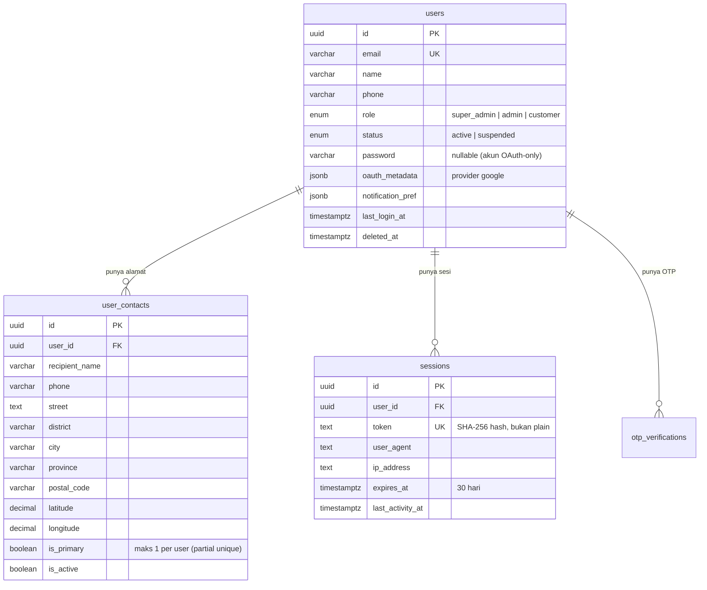
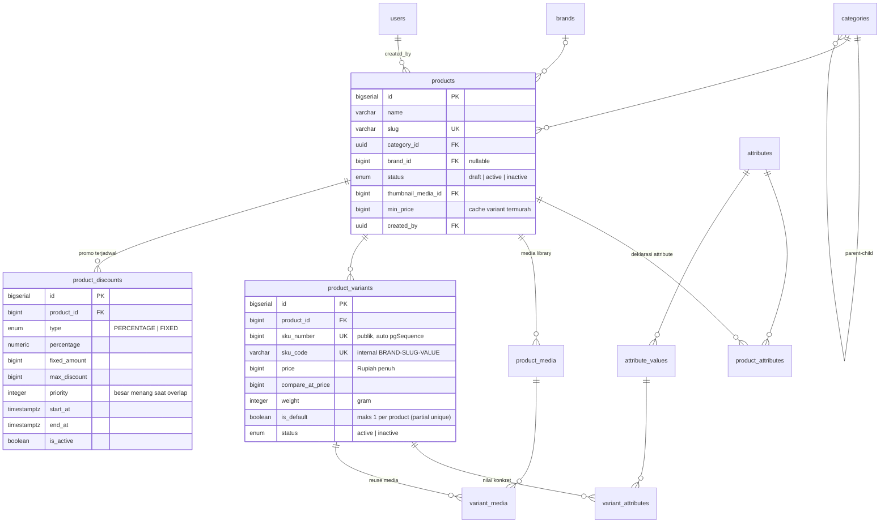
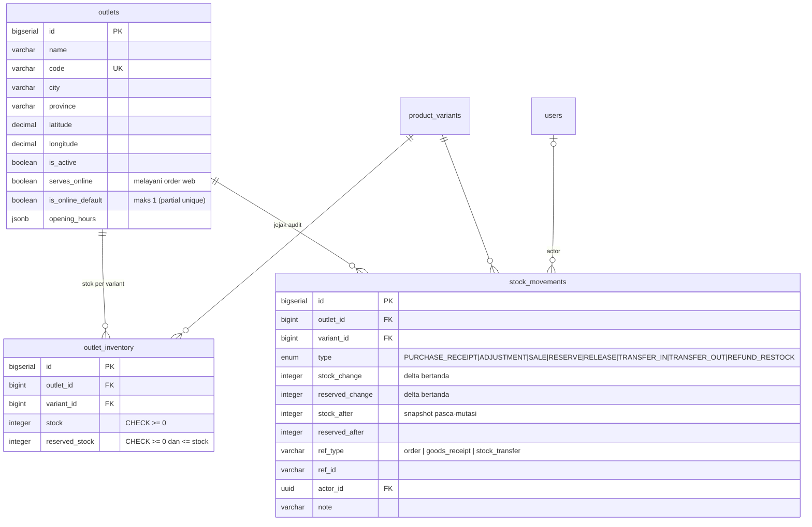
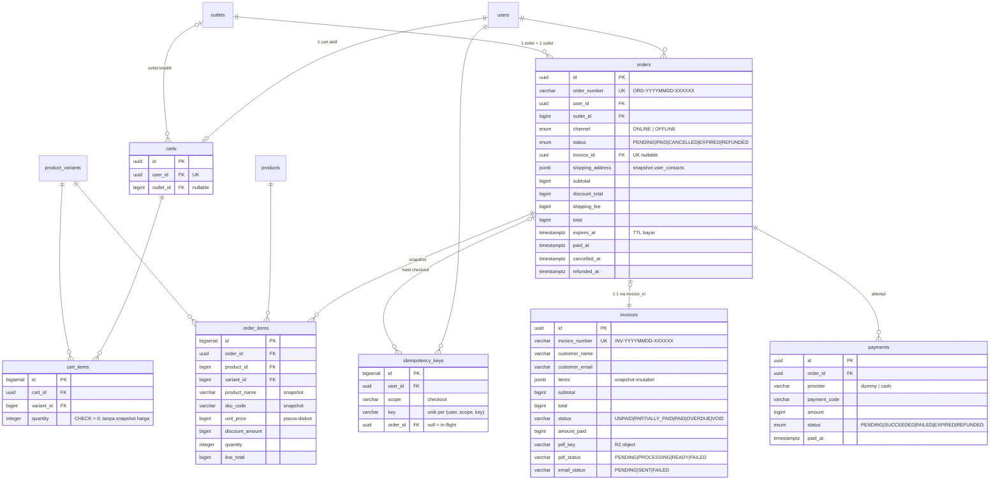
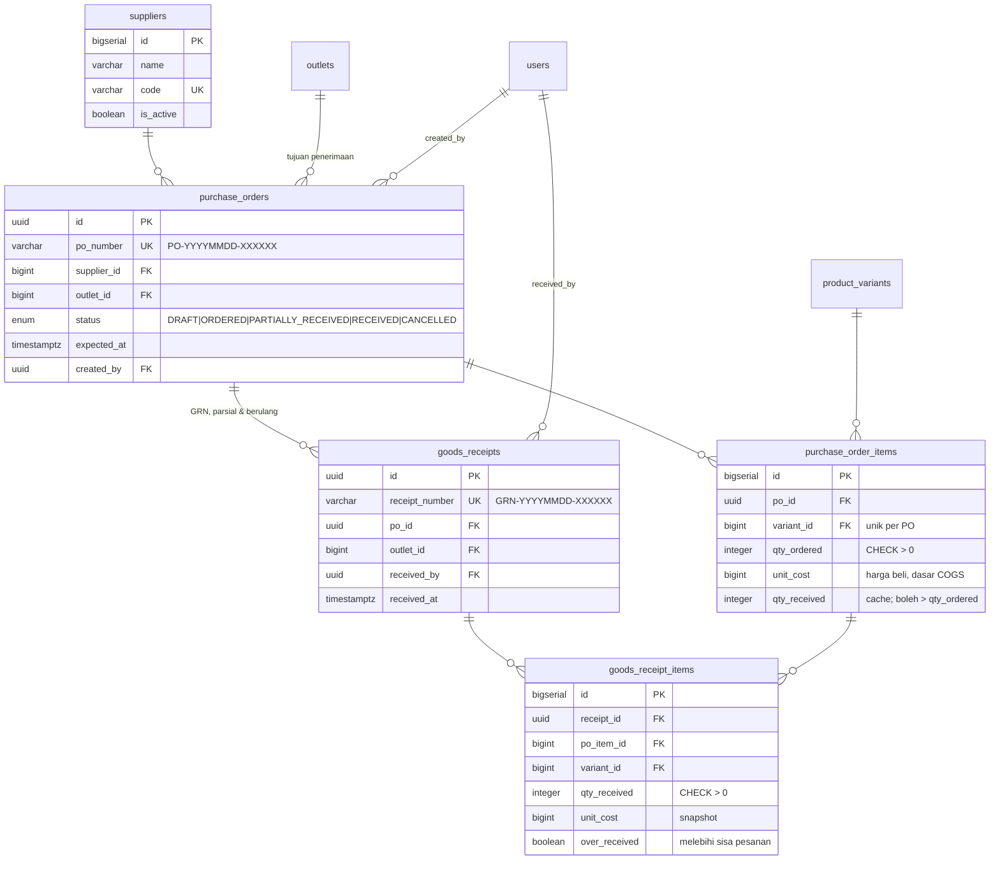
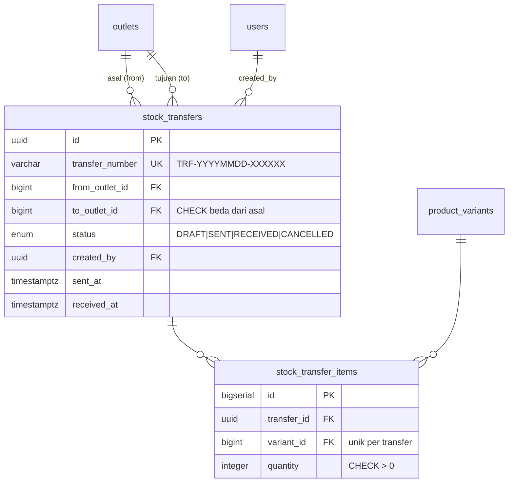
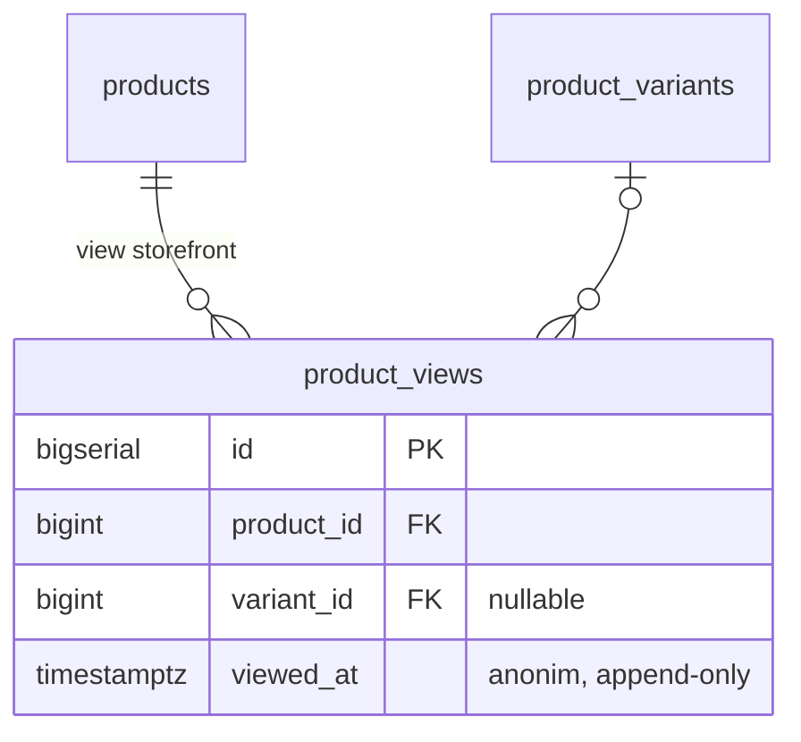

# ERD — Ecommerce Backend

Diagram relasi entitas, dikelompokkan per bounded context agar terbaca.
Sumber kebenaran: `src/infrastructure/database/schema/*.entity.ts` (migrasi `drizzle/migrations/`).

**Konvensi id**: master data internal memakai `bigserial` (brands, attributes, products,
variants, outlets, suppliers); entitas publik/dokumen memakai `uuid` v7 time-ordered
(users, categories, invoices, orders, carts, payments, PO, GRN, transfers).
**Uang** = `bigint` Rupiah penuh. **Soft delete** = kolom `deleted_at`.

---

## 1. Identity & Auth

## 2. Katalog

> Stok **tidak** disimpan di `product_variants` — sepenuhnya per-outlet (lihat bagian 3).

## 3. Outlet, Inventori & Ledger Audit

> `outlet_inventory` unik per `(outlet_id, variant_id)`. **Available = stock − reserved_stock.**
> `stock_movements` append-only; SEMUA mutasi stok lewat satu pintu (`OutletsRepository`)
> dan menulis ledger dalam transaksi yang sama.

## 4. Cart, Order, Payment, Invoice

> `payments` punya partial unique: maksimal **satu attempt PENDING per order**.
> Invoice menyimpan item sebagai **jsonb snapshot** (imutabel terhadap perubahan katalog).

## 5. Pembelian (Purchasing)

## 6. Transfer Stok Antar Outlet

## 7. Analytics (Event)

---

## Catatan integritas penting

| Mekanisme | Lokasi | Tujuan |
|---|---|---|
| Partial unique `is_primary` | `user_contacts` | Satu alamat utama per user |
| Partial unique `is_default` | `product_variants` | Satu variant default per product |
| Partial unique `is_online_default` | `outlets` | Satu outlet fallback routing online |
| Partial unique `status = PENDING` | `payments` | Satu attempt pembayaran aktif per order |
| Unique `(user, scope, key)` | `idempotency_keys` | Anti order ganda saat retry checkout |
| CHECK `reserved <= stock`, `>= 0` | `outlet_inventory` | Pagar terakhir anti-overselling |
| UPDATE atomic bersyarat | reservasi/finalisasi stok | Anti race antar checkout tanpa lock eksplisit |
| Append-only + snapshot after | `stock_movements` | Jejak audit stok dapat direkonstruksi |
